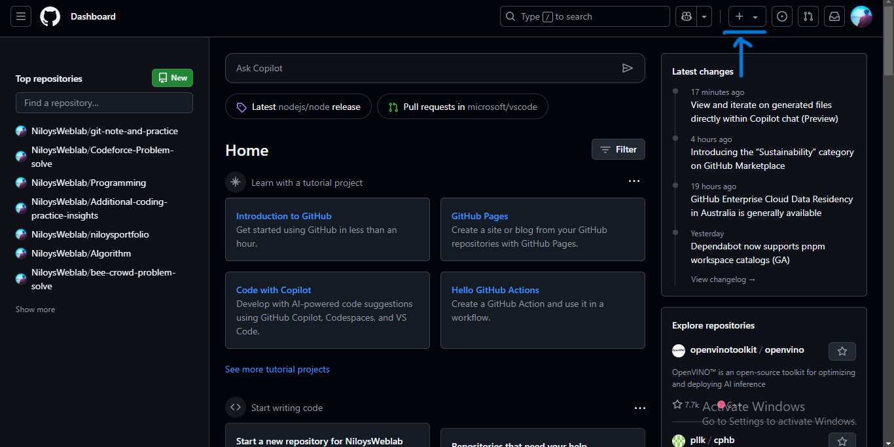
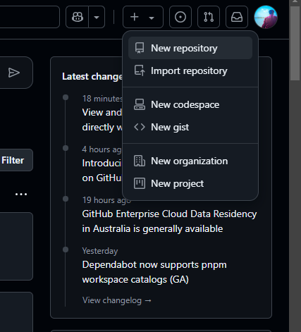
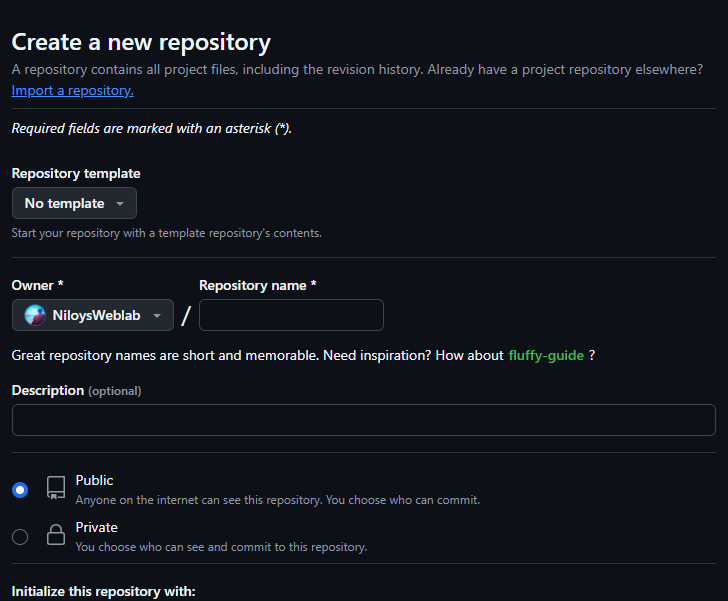
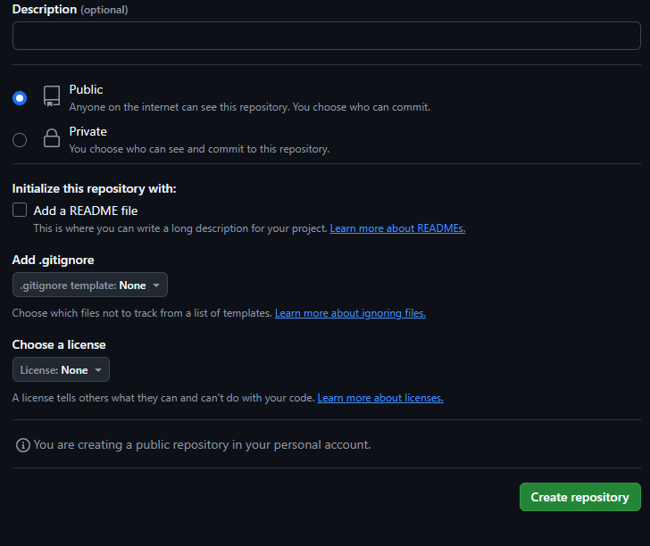
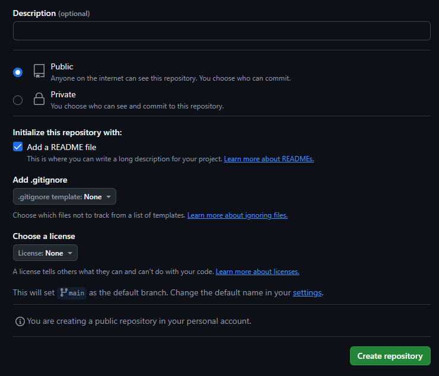
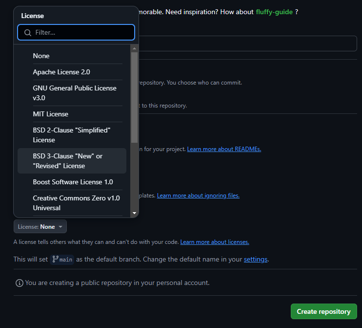

<!--Markdown Practice-->
# Git and GitHub Note

Here is my **Git** and **GitHub** practice note, where I have documented important commands, concepts, and workflows related to version control and repository management.  

It will help anyone who follows this note to learn Git and GitHub just as I have.

## What is Git?

**Git** is a tool that helps manage and track changes in code.  

- It saves different versions of a project so you can go back if needed.  
- Multiple people can work on the same project without overwriting each other’s work.  
- You can create separate branches to try new ideas safely.  
- It allows merging, so changes from different people can be combined easily.  
- Git works on your computer but can also sync with online platforms like GitHub.
## Are Git and GitHub the same?

Git and GitHub are not the same, but they work together.

- Git is a tool that helps you track and manage changes to your code on your computer. It keeps a history of every change you make, so you can go back to previous versions if needed.

- GitHub is a website where you can store your Git repositories (code projects) online. It also helps you share your code with others and collaborate easily.

## Why Learning Git and GitHub is Important

Learning Git and GitHub is an essential skill for anyone interested in software development. Here’s why:

- **Collaboration Made Easy:** Git lets multiple developers work on the same project without messing up each other’s work. GitHub makes it easy to share and collaborate on code with others.
  
- **Track Changes and Manage Versions:** Git helps you keep track of all the changes made to your code, so you can always go back to earlier versions if something goes wrong.
  
- **A Must-Have Skill for Developers:** Almost every company uses Git and GitHub, and knowing them is expected from developers. It’s a key skill in the tech industry.

- **Better Job Opportunities:** Employers look for developers who know how to manage code effectively, and Git/GitHub expertise can make you stand out.

learning Git and GitHub will help you work more efficiently, collaborate better, and make you job-ready in the tech world.

## Install Git & Create a GitHub Account  

**1. Install Git:**  
- Download Git from [git-scm.com](https://git-scm.com/downloads).  
- Install it with default settings.  
- Verify by running `git --version` in the terminal.  

**2. Create a GitHub Account:**  
- Go to [GitHub](https://github.com/) and sign up.  
- Verify your email and set up your profile.  

<br>

# Time to Explore Git!

### Start Learning Git from CMD  

Let’s start directly with using **Git in the Windows Command Prompt (cmd)** to manage code and track changes. By learning Git through CMD, a deeper understanding of version control can be gained at its core.  

#### **Getting Started:**  
1. **Open CMD:** Press **Win + R**, type `cmd`, and hit **Enter** to open the Command Prompt.  
2. **Check Git Installation:** Type the following command and press **Enter**:  
   ```
   git --version
   ```  
   If Git is installed, the version number will be displayed.   

3. **Next, let's configure Git using `git config`**  
This step involves setting your username and email so that Git can track your commits properly. It ensures your contributions are identified correctly in every repository.

### What is `git config`?  

`git config` is a command used to set configuration options for Git. It helps to customize your Git environment, such as setting your username, email, and other preferences that Git uses to track your activity.  

#### **Setting Username and Email**  

When using Git, each commit needs to be associated with a name and email to identify the author. You can set these details using the following commands:  

1. **Set Username:**  
   ```sh
   git config --global user.name "Your Name"
   ```  

2. **Set Email:**  
   ```sh
   git config --global user.email "your-email@example.com"
   ```  

The `--global` flag means these settings will apply to all repositories on your computer. If you want to set a different username or email for a specific repository, you can omit the `--global` flag and run the commands inside the repository folder.

#### Without Global Command for a Specific Repository
To set the username and email only for a specific repository, navigate to the repository folder and use the following commands:

1. **Set Username:**

```sh
git config user.name "Your Name"
```

2. **Set Email:**

```sh
git config user.email "your-email@example.com"
```

These settings will apply only to the current repository and will not affect other repositories on your system.

#### **Why is This Important?**  

- **Identifying Commits:** Every commit you make is tagged with your username and email, allowing others to identify who made which changes in a project.  
- **Collaboration:** It’s crucial when collaborating on projects to have accurate information about who is responsible for changes.  
- **Consistency:** Using the same username and email across all projects helps maintain consistency in your version history.  

#### **Removing Git Username and Email Configuration**  

If you need to remove or reset the username and email configuration in Git, you can do so using the following commands.  

#### **1. Remove Global Username and Email**  
To remove the globally set username and email, use:  

```sh
git config --global --unset user.name
git config --global --unset user.email
```  

This will clear the globally configured values, meaning Git will no longer associate a name and email with your commits unless set again.  

#### **2. Remove Repository-Specific Username and Email**  
If you have set a username and email for a specific repository and want to remove them, navigate to the repository folder and run:  

```sh
git config --unset user.name
git config --unset user.email
```  

This removes the username and email only for that particular repository. 

### **Create Directory and File**  

You can create a directory manually or by using the Command Prompt.  

#### **1. Creating a Directory Using Command Prompt**  

1. **Go to a Drive (if needed):**  
   - To switch to the `D:` drive, type:  
     ```sh
     D:
     ```  
   - To switch to the `C:` drive, type:  
     ```sh
     C:
     ```  

3. **Navigate to a Folder (if needed):**  
   - Example:  
     ```sh
     cd Projects
     ```  

4. **Create a New Directory:**  
   - Example:  
     ```sh
     mkdir gitPractice
     ```  

5. **Enter the Directory:**  
   - Example:  
     ```sh
     cd gitPractice
     ```  

#### **2. Creating a File Using Command Prompt** 
For Git learning, as a beginner, we start by creating a simple .txt file. After gaining experience, you can use files with any extension.


1. **Create a Text File:**  

   ```sh
   echo. > test.txt
   ```  

Now, the directory and file are ready for use.

### **Initialize Git in the Directory**

Once you have created the directory and file, you can initialize a Git repository in it using the following command:

Run the command to initialize Git:  
```sh
git init
```

This will create a `.git` folder inside the directory, marking it as a Git repository. You can confirm this by using the following command:  
```sh
dir /a
```

Now, you can start tracking changes and managing version control.

### **Three Stages of Local Repository Version Controlling**  

Git tracks files in three stages during version control:  

1. **Working Directory (Untracked Area)**  
   When a file is created or modified, it remains in the working directory. At this stage, Git does not track the file, meaning it is untracked.  

2. **Staging Area (Ready for Commit)**  
   To track changes, the file must be added to the staging area. Once added, it becomes ready for the next commit. The staging area holds changes that are prepared to be saved.  

3. **Committed (Tracked State)**  
   After staging, the file is committed to the repository. Once committed, Git starts tracking the file, saving its version history for future reference.


### **Tracking and Managing Changes in Git**  

After modifying a file, the differences between the current and previous version can be checked using:  
```sh
git diff
```  
This helps to see what has changed before adding it to staging.  

If needed, the file can be restored to its previous state before modification:  
```sh
git restore filename.txt
```  
Or, it can be added to the staging area for committing:  
```sh
git add filename.txt
```  
To verify the file's status:  
```sh
git status
```  

If a staged file needs to be removed from the staging area without deleting it, use:  
```sh
git restore --staged filename.txt
```  
Check the status again using:  
```sh
git status
```  

Once ready, commit the changes to save them in the repository:  
```sh
git commit -m "Commit message"
```  
To confirm the commit status:  
```sh
git status
```  

If a file is no longer needed in the repository but should remain in the working directory, remove it from tracking with:  
```sh
git rm --cached filename.txt
```  
Check the status after the removal:  
```sh
git status
```  

For efficiency, `git add` and `git commit` can be combined into a single command using `&&`:  
```sh
git add filename.txt && git commit -m "Commit message"
```  
Finally, use `git status` to verify the changes.

Sure thing! Here it goes:

---

### **Viewing Commit History**  

The `git log` command is used to see the history of commits in a repository. It provides detailed information about each commit, including who made the changes, when they were made, and a unique identifier for each commit.

**Command:**  
```sh
git log
```

**Example Output:**  
```
commit a3c4f1b (HEAD -> main)
Author: Your Name <your-email@example.com>
Date:   Fri Feb 2 14:15:26 2025 +0000

    Added initial project files
```

**Parts of the Commit Information:**  
- **Commit Hashcode:** `a3c4f1b`  
  - A unique identifier for this specific commit. It allows you to reference or revert to this exact state of the repository.  

- **Author:** `Your Name <your-email@example.com>`  
  - The username and email of the person who made the commit. This is set by `git config` and helps identify the contributor.  

- **Date:** `Fri Feb 2 14:15:26 2025 +0000`  
  - The exact time and date when the commit was made. Useful for tracking the timeline of changes.  

- **Commit Message:** `Added initial project files`  
  - A brief description of the changes made in this commit. It's important for understanding the purpose of the commit, especially when looking back at the history.  

**Using `git log` Effectively:**  
- To see a simpler, condensed version of the log:  
  ```sh
  git log --oneline
  ```
- To see changes along with commit messages:  
  ```sh
  git log -p
  ```
- To filter by author:  
  ```sh
  git log --author="Your Name"
  ```

`git log` is super handy for understanding the history of a project and for collaboration, so everyone knows what changes were made and why!

### **Understanding `.gitignore` in Git**  

The `.gitignore` file tells Git which files and directories to **ignore** and not track in the repository. This is useful for excluding temporary files, logs, dependencies, and system-generated files that don’t need version control.  

#### **How `.gitignore` Works:**  
- Prevents unnecessary files from being committed.  
- Keeps the repository clean and organized.  
- Avoids tracking sensitive or system files.  

#### **Creating and Initializing `.gitignore`**  
1. Create a `.gitignore` file in the root directory:  
   ```sh
   echo .gitignore > .gitignore
   ```
2. Open the file and add patterns for files or folders to ignore.  

#### **What to Write in `.gitignore`**  
You can list specific files, directories, or patterns. Examples:  
```
# Ignore all text files except important.txt
*.txt  
!important.txt  

# Ignore all log files
*.log  

# Ignore node_modules folder
node_modules/  

# Ignore compiled binaries
*.exe  

# Ignore system files
.DS_Store  
Thumbs.db  
```

#### **Applying `.gitignore`**  
After adding patterns, track the `.gitignore` file and commit it:  
```sh
git add .gitignore  
git commit -m "Added .gitignore file"
```

Now, Git will **not track** the specified files, keeping your repository clean.

### **`git reset` Commands**  

The `git reset` command is used to **undo commits** and move the HEAD pointer to a previous state. It can reset commits in different ways, depending on the options used.  

---

### **1. `git reset HEAD^` (Mixed Reset - Default)**  
- Moves the **HEAD** pointer one commit back.  
- **Unstages** the last commit but keeps the file changes in the working directory.  
- You can re-add and commit the changes again if needed.  

**Example:**  
```sh
git reset HEAD^  
```
**Effect:** The commit is removed from the history, but the changes remain in the working directory.  

---

### **2. `git reset --hard HEAD^` (Hard Reset - DANGER)**  
- Moves **HEAD** one commit back **and permanently deletes** the changes.  
- **All modifications in the last commit will be lost.**  

**Example:**  
```sh
git reset --hard HEAD^  
```
**Effect:** The commit is erased, and all changes from that commit are removed from both the staging area and working directory.  

**Warning:** Cannot be undone unless you have a backup or remember the commit hash.  

---

### **3. `git reset --soft HEAD~<number>` (Soft Reset)**  
- Moves **HEAD** back by a specified number of commits.  
- **Does not remove changes**; all modified files remain **staged**.  

**Example (reset the last 2 commits):**  
```sh
git reset --soft HEAD~2  
```
**Effect:** The last two commits are undone, but their changes remain **ready for commit**.  

---

### **When to Use Each Type of Reset?**  
| Command | Effect | Use Case |
|---------|--------|----------|
| `git reset HEAD^` | Undo last commit, keep changes unstaged | When you committed too soon but need to edit files |
| `git reset --hard HEAD^` | Undo commit and delete changes permanently | When you want to remove commits completely |
| `git reset --soft HEAD~<n>` | Undo multiple commits, keep changes staged | When you want to rework previous commits |

These commands help manage commits efficiently while avoiding unnecessary mistakes.

### **"Checkout": A Safer Way to Move Between Commits Instead of `git reset`**  

When working with Git, sometimes you need to go back to a previous commit. There are two main ways to do this:  

1. **`git reset`** – Moves the branch pointer and can modify history.  
2. **`git checkout`** – A safer way to view or switch to a previous commit without modifying history.  

Using `git reset` can **permanently remove commits**, so a safer approach is to use `git checkout` when exploring old commits.  

---

### **1. Checking Out a Previous Commit (`git checkout <commitId>`)**  
- Moves to a specific commit without deleting history.  
- The repository enters a **detached HEAD** state.  
- To find commit IDs, use:  
  ```sh
  git log --oneline
  ```
  Example output:  
  ```
  f7a3c92 Fixed login issue
  b519fd2 Updated README file
  8c9e0d1 Initial commit
  ```
  Here, `f7a3c92` is the latest commit.  

- **To move to an old commit (e.g., `b519fd2`):**  
  ```sh
  git checkout b519fd2
  ```
  **Effect:** Moves the working directory to the state of `b519fd2`.  

---

### **2. Checking Out the Master/Main Branch (`git checkout master`)**  
- Returns to the latest commit in the `master` branch.  
- Useful after checking out an old commit.  

```sh
git checkout master
```
👉 **Effect:** Switches back to the latest commit in `master`.  

If using `main`:  
```sh
git checkout main
```  

---

### **Key Differences and Best Practices**  
- **`git reset`** alters commit history and should be used with caution.  
- **`git checkout <commitId>`** allows safely navigating to previous commits without modifying history.  
- **Use at least the first 7 characters of a commit ID**, which can be found using `git log --oneline`.  
- Before making new commits, always return to the main branch using `git checkout master`.

### **Git Aliases: Creating Shortcuts for Commands**  

Git allows creating **aliases** to shorten long commands, making them easier to use.  

#### **Setting Up an Alias**  
To create an alias, use the following command:  
```sh
git config --global alias.shortcut "command"
```  
For example, to shorten `git status` to `git st`:  
```sh
git config --global alias.st "status"
```  
Now, running `git st` will execute `git status`.  

#### **Removing an Alias**  
To remove an alias, use:  
```sh
git config --global --unset alias.aliasName
```  
For example, to remove the `st` alias:  
```sh
git config --global --unset alias.st
```  
Aliases help speed up workflow by reducing typing effort.

### **Introduction to Remote Repository**  

A **remote repository** is a version-controlled repository stored on a hosting service like **GitHub, GitLab, or Bitbucket**. Unlike a local repository that exists only on a personal computer, a remote repository is accessible from anywhere, making it essential for **team collaboration, backup, and deployment**.  

#### **Why Use a Remote Repository?**  

- **Code Storage & Backup** – Protects code from data loss due to system failures.  
- **Collaboration** – Enables multiple developers to work on the same project without conflicts.  
- **Version Control** – Tracks changes, allowing you to revert to previous versions if needed.  
- **Project Hosting** – Supports both open-source and private projects for better organization.  
- **Team Workflow** – Allows contributors to propose changes, review code, and merge updates easily.  
- **Continuous Integration & Deployment (CI/CD)** – Automates testing and deployment processes.  
- **Access Control** – Restricts or grants permissions to specific users for security and management.  

Remote repositories improve software development by **keeping projects synchronized, organized, and scalable**.

### **Introduction of GitHub**  

GitHub is the **largest Git-based remote repository platform**, used by **over 100 million developers and 4 million companies**, including **Google, Microsoft, and Facebook**. It hosts **330+ million repositories**, making collaboration and version control easier.  

#### **Why Use GitHub?**  
- **Code Collaboration** – Work with teams, review code, and track changes.  
- **Version Control** – Easily manage and revert code changes.  
- **Public & Private Repos** – Supports both open-source and private projects.  
- **Issue Tracking** – Manage bugs and project tasks efficiently.  
- **Security & CI/CD** – Secure access controls and automated workflows.  

GitHub is a vital tool for **developers and businesses** to build, share, and manage projects efficiently.

### **Creating a GitHub Repository**  

After signing up for **GitHub**, you will see the **GitHub Dashboard**. At the top right, there is a **"+" icon**. Click on it, then select **"New repository"** from the dropdown menu. This will take you to the repository creation page. 

<div align="center">
  
</div>
<div align="center">
    
</div>

#### **Steps to Create a Repository:** 


1. **Enter Repository Name**  
   - Use **only letters, numbers, hyphens (-), or underscores (_)**.  
   - If you use **spaces, they will be converted to hyphens (-) automatically**.

      


2. **Write a Short Description (Optional)**  
   - This helps others understand your project.

3. **Choose Repository Privacy**  
   - **Public**: Anyone can view the code.  
   - **Private**: Only selected people can access it.

      


4. **Initialize with a README (Optional)**  
   - The **README file** provides an overview of your project. 

      
 

5. **Select a License (Optional)**  
   - Choose from predefined **open-source licenses** to define usage rights. 

   

6. **Click the "Create Repository" Button**  
   - Your repository is now ready!  
  

This **remote repository** allows you to **store code, track changes, add projects, collaborate with teams, and even contribute to other repositories**.


### **Introduction to README.md File**  

A **README.md** file is a markdown file used in **GitHub repositories** to provide an overview of a project. The `.md` extension stands for **Markdown**, a lightweight markup language for formatting plain text. README files typically contain **project descriptions, installation instructions, usage guidelines, contributor information, and license details**.  

### **Overview of Markdown**  

**Markdown** is a simple way to format text using plain-text symbols. It is widely used for **documentation, blogging, online discussions, and README files in GitHub repositories**. Markdown allows for easy text formatting without needing HTML or complex styling. It is readable as plain text and converts into structured documents when rendered.  

Some common uses of Markdown include:  
- Writing **formatted text** (bold, italic, headings, etc.)  
- Creating **lists, tables, and code blocks**  
- Adding **links and images**  
- Structuring project documentation  

Markdown makes it easy to **write, share, and maintain documentation** with minimal effort. It is supported in many platforms, including **GitHub, GitLab, Bitbucket, and various CMS platforms**.

---

Here is the Markdown syntax with examples shown after each syntax section.

---

### **Markdown Syntax and Usage**  

#### **1. Comment**  
Markdown does not support comments natively, but HTML comments work:  
```html
<!-- This is a comment -->
```
**Example Output:** (No visible output in Markdown)

---

#### **2. Divider (Horizontal Line)**  
Creates a horizontal line to separate content:  
```markdown
___
---
***
<hr>
```
**Example Output:**
___
---
***
<hr>

---

#### **3. Headings**  
Use `#` for different heading sizes:  
```markdown
# Largest Heading
## Second Largest
### Third Largest
#### Fourth
##### Fifth
###### Smallest Heading
```
**Example Output:**  
# Largest Heading  
## Second Largest  
### Third Largest  
#### Fourth  
##### Fifth  
###### Smallest Heading  

---

#### **4. Paragraph**  
Write text normally or use HTML:  
```markdown
This is a paragraph.

<p>This is also a paragraph.</p>
```
**Example Output:**  

This is a paragraph.  

This is also a paragraph.  

---

#### **5. Italic Text**  
Use `_` or `*` to make text italic:  
```markdown
_text_  
*text*  

<i>text</i>  <!-- HTML way -->
```
**Example Output:**  
_text_  
*text*  
*text*  

---

#### **6. Bold Text**  
Use `__` or `**` for bold text:  
```markdown
__text__  
**text**
```
**Example Output:**  
**text**  
**text**  

---

#### **7. Strikethrough (Deleted Text)**  
Use `~~` around text:  
```markdown
~~text~~
```
**Example Output:**  
~~text~~  

---

#### **8. Inline Code**  
Use backticks for inline code snippets:  
```markdown
`text`
```
**Example Output:**  
`text`  

---

#### **9. Multiline Code Block**  
For general text formatting:  
```markdown
```
text
text
```
```
**Example Output:**  
```
text
text
```

---

#### **10. Code Block for a Programming Language**  
Specify the language name:  
```markdown
```cpp
int main() {
    return 0;
}
```
```
**Example Output:**  
```cpp
int main() {
    return 0;
}
```

---

#### **11. Ordered List (Numbered List)**  
```markdown
1. Item 1  
2. Item 2  
3. Item 3  
```
**Example Output:**  
1. Item 1  
2. Item 2  
3. Item 3  

---

#### **12. Unordered List (Bullet Points)**  
```markdown
- Item 1  
- Item 2  
- Item 3  
```
**Example Output:**  
- Item 1  
- Item 2  
- Item 3  

---

#### **13. Task List (Checklist)**  
```markdown
- [x] Completed task  
- [ ] Incomplete task  
```
**Example Output:**  
- [x] Completed task  
- [ ] Incomplete task  

---

#### **14. Links**  

- **Automatic Link**  
  ```markdown
  https://example.com
  ```
  **Example Output:**  
  https://example.com  

- **Disabled Link (Shows as Text)**  
  ```markdown
  `https://example.com`
  ```
  **Example Output:**  
  `https://example.com`  

- **Title-based Link**  
  ```markdown
  [GitHub](https://github.com)
  ```
  **Example Output:**  
  [GitHub](https://github.com)  

- **Separated Link Reference**  
  ```markdown
  [GitHub][github-link]

  <!-- At the bottom -->
  [github-link]: https://github.com
  ```
  **Example Output:**  
  [GitHub](https://github.com)  

---

#### **15. Images**  
```markdown

```
**Example Output:**  


Example with title:  
```markdown

```
**Example Output:**  


HTML way:  
```html

```
**Example Output:**  


---

#### **16. Tables**  
```markdown
| Header 1 | Header 2 |
|----------|----------|
| Data 1   | Data 2   |
| Data 3   | Data 4   |
```
**Example Output:**  

| Header 1 | Header 2 |
|----------|----------|
| Data 1   | Data 2   |
| Data 3   | Data 4   |

---

Markdown is widely used in GitHub for documentation, project descriptions, and formatting discussions. It is simple, effective, and enhances readability without needing complex HTML or CSS.